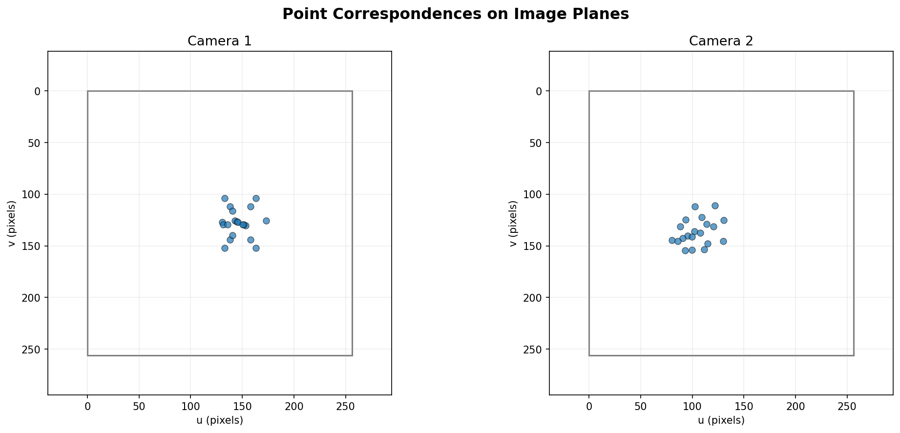
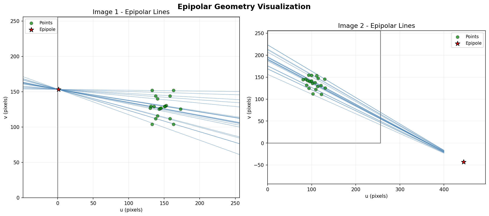
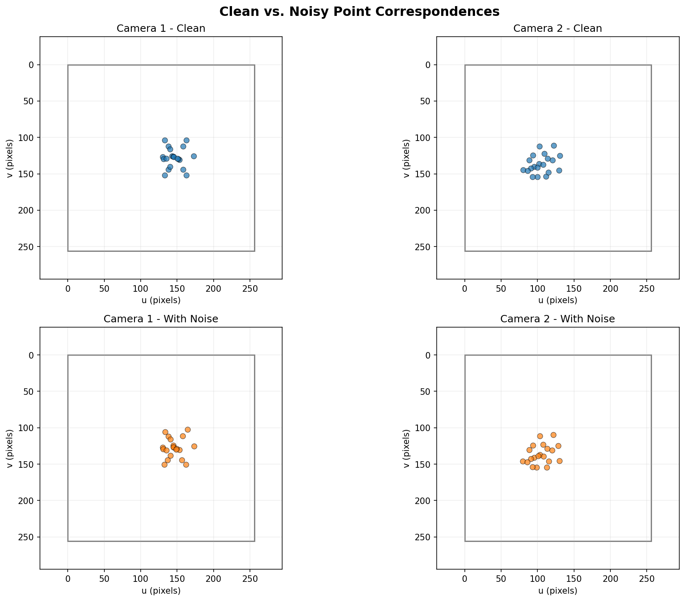
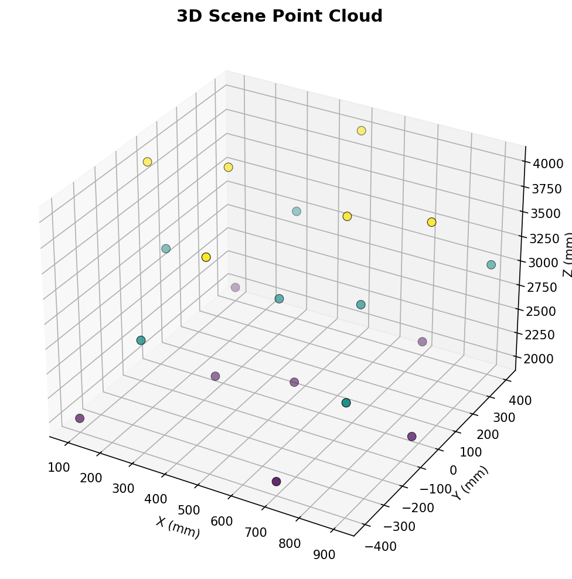
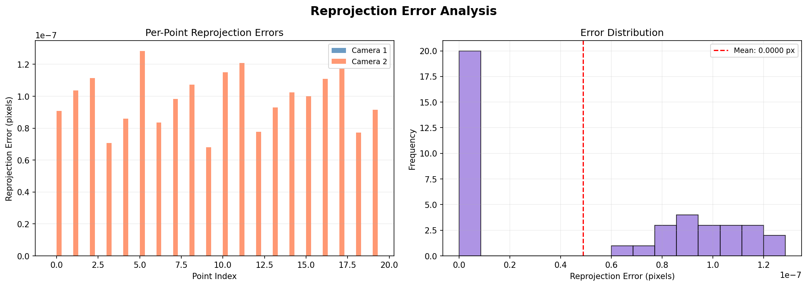
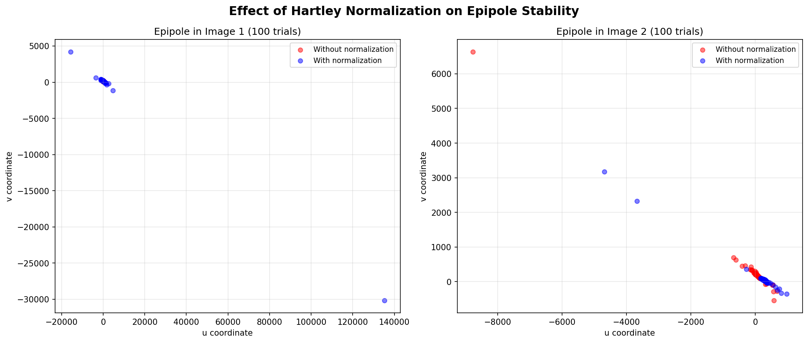

# Multi-View Geometry: Fundamental Matrix Estimation and 3D Reconstruction

A comprehensive implementation of multi-view geometry algorithms for estimating epipolar geometry from point correspondences, recovering camera pose, and performing 3D scene reconstruction. The project implements the normalized 8-point algorithm, essential matrix decomposition, linear triangulation, and includes a systematic evaluation of estimation robustness under noise.

---

## Overview

This project implements a complete multi-view geometry pipeline that takes two calibrated camera views of a 3D scene and:

1. Estimates the fundamental matrix relating the two views using the **normalized 8-point algorithm**
2. Validates the estimate by computing epipoles through **three independent methods**
3. Recovers the **essential matrix** and decomposes it into rotation and translation
4. Performs **linear triangulation** (DLT) to recover 3D structure
5. Evaluates estimation quality through **reprojection error** and **Sampson distance**
6. Analyzes the impact of **Hartley normalization** on robustness to noise

## Pipeline

```
3D Scene Points
      |
      v
  Projection (P1, P2)
      |
      v
  2D Correspondences -----> Noise Injection (optional)
      |                            |
      v                            v
  Fundamental Matrix      Robustness Analysis
  (8-Point Algorithm)     (100 trials, +/- normalization)
      |
      +-------+--------+
      |       |        |
      v       v        v
   Epipoles  Essential  Epipolar
   (3 methods) Matrix   Distances
              |
              v
        Camera Pose (R, t)
              |
              v
        Triangulation (DLT)
              |
              v
        3D Reconstruction
              |
              v
        Reprojection Error
```

## Mathematical Foundations

### Epipolar Constraint

For corresponding points **x** and **x'** in two views, the fundamental matrix **F** encodes the constraint:

```
x'^T F x = 0
```

Every point in one image defines an epipolar line `l' = Fx` in the other image, on which the corresponding point must lie. All epipolar lines converge at the **epipole** — the projection of one camera center into the other image.

### Fundamental Matrix Properties

The fundamental matrix **F** is a 3x3 matrix of rank 2 with 7 degrees of freedom:
- It maps points to epipolar lines: `l' = Fx`, `l = F^T x'`
- The epipoles satisfy: `Fe = 0`, `F^T e' = 0`
- The **rank-2 constraint** (`det(F) = 0`) ensures all epipolar lines are concurrent

### Hartley Normalization

Raw pixel coordinates lead to poorly conditioned systems. Hartley normalization transforms points so that:
- The centroid is at the origin
- The average distance from the origin is sqrt(2)

This conditioning is critical for numerical stability and dramatically reduces sensitivity to noise in the 8-point algorithm.

### SVD-Based Estimation

The 8-point algorithm formulates the epipolar constraint as a homogeneous linear system **Af = 0**, where each correspondence contributes one equation. The solution is the right singular vector corresponding to the smallest singular value of **A**. The rank-2 constraint is enforced by zeroing the smallest singular value of the recovered **F**.

### Sampson Distance

The Sampson distance provides a first-order approximation to the geometric error:

```
d_sampson = (x'^T F x)^2 / (||Fx||_2^2[0:2] + ||F^T x'||_2^2[0:2])
```

This metric efficiently evaluates the quality of the fundamental matrix without requiring explicit triangulation.

### Triangulation

Given the projection matrices **P1**, **P2** and corresponding points, 3D structure is recovered via the **Direct Linear Transform (DLT)**. For each correspondence, a 4x4 system is constructed from the projection equations and solved through SVD.

## Experimental Results

### Point Correspondences


### Epipolar Geometry


### Clean vs. Noisy Correspondences


### 3D Reconstruction


### Reprojection Error Analysis


### Normalization Sensitivity


## Key Insights

- **Hartley normalization is essential**: Without normalization, the design matrix is severely ill-conditioned. The scatter plot of epipole estimates across 100 noise trials shows dramatically tighter clustering with normalization enabled
- **Rank-2 enforcement is mandatory**: The analytically correct fundamental matrix is inherently rank-2, but estimation from noisy data produces a full-rank matrix. SVD-based rank reduction is required for geometric consistency
- **Multiple epipole methods agree**: Computing epipoles via SVD null space, epipolar line intersection, and camera center projection yields consistent results, validating the estimation pipeline
- **Degenerate configurations exist**: When all 3D points are coplanar, or when translation is zero, the fundamental matrix becomes undefined or degenerate
- **Noise sensitivity varies spatially**: Points farther from the image center and at extreme depths show higher reprojection errors

## Project Structure

```
multi-view-geometry-project/
|
├── src/
│   ├── __init__.py
│   ├── feature_matching.py      # Camera setup, synthetic correspondences
│   ├── fundamental_matrix.py    # 8-point algorithm, normalization, Sampson
│   ├── essential_matrix.py      # E matrix, pose decomposition, cheirality
│   ├── epipolar_geometry.py     # Epipolar lines, epipoles, distances
│   ├── triangulation.py         # DLT triangulation, reprojection error
│   ├── visualization.py         # All plotting functions
│   └── main.py                  # End-to-end pipeline
│
├── notebooks/
│   └── exploration.ipynb        # Interactive exploration notebook
│
├── report/
│   ├── project_report.md        # Technical report
│   └── result_images/           # Generated visualizations
│
├── results/
│   └── evaluation_summary.txt   # Quantitative evaluation
│
├── README.md
└── requirements.txt
```

## How to Run

### Prerequisites

```bash
pip install -r requirements.txt
```

### Execute the Pipeline

From the project root directory:

```bash
python -m src.main
```

This will:
1. Configure the stereo camera pair
2. Generate synthetic point correspondences
3. Estimate the fundamental and essential matrices
4. Compute epipoles using three methods
5. Triangulate 3D points and evaluate reprojection error
6. Run 100-trial noise sensitivity analysis
7. Save all result visualizations to `report/result_images/`
8. Write the evaluation summary to `results/evaluation_summary.txt`

## Dependencies

| Package    | Version | Purpose                          |
|------------|---------|----------------------------------|
| NumPy      | >= 1.21 | Linear algebra, matrix operations |
| Matplotlib | >= 3.5  | Result visualization             |
| SciPy      | >= 1.7  | Numerical utilities              |

## Applications

The algorithms and techniques implemented in this project form the foundation of:

- **Visual SLAM** (Simultaneous Localization and Mapping) — real-time camera pose estimation and map construction
- **Stereo Vision** — depth estimation from calibrated camera pairs
- **Structure from Motion (SfM)** — 3D reconstruction from unordered image collections
- **Autonomous Navigation** — environmental perception for self-driving vehicles and drones
- **Robotics Perception** — object localization and manipulation in 3D space
- **Augmented Reality** — aligning virtual content with real-world geometry

## References

- Hartley, R. and Zisserman, A. *Multiple View Geometry in Computer Vision*, Cambridge University Press, 2004.
- Longuet-Higgins, H.C. "A computer algorithm for reconstructing a scene from two projections," *Nature*, 293:133-135, 1981.
- Hartley, R.I. "In defense of the eight-point algorithm," *IEEE TPAMI*, 19(6):580-593, 1997.

## License

This project is released under the MIT License. See [LICENSE](LICENSE) for details.
